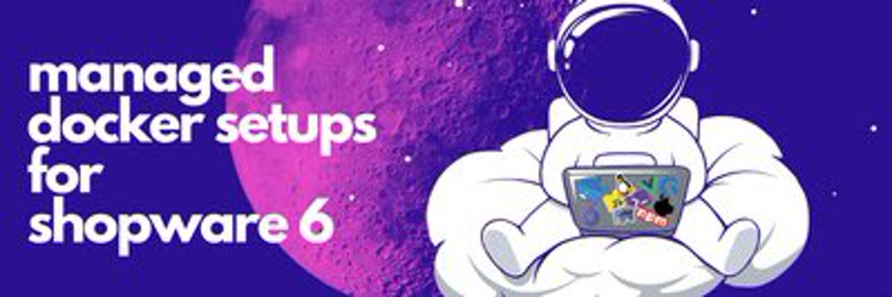

## Dockware

Hi guys,
thanks for visiting the dockware project (www.dockware.io)

## What is dockware?

dockware is a managed Shopware 6 docker image.

Run and explore any Shopware 6 version within minutes locally in Docker.
No more hassle and blazing fast!
With dockware it's easy to explore Shopware and start developing in a smooth and seamless environment!

## Quick reference

Where to get help: https://www.dockware.io

Where to file issues: https://www.dockware.io

Documentation: https://dockware.io/docs

Maintained by: dasistweb GmbH (https://www.dasistweb.de)

More about Shopware: https://www.shopware.com

Shopware Platform on Github: https://github.com/shopware/platform

## Where to get support?

If you have a issue or a feature Request, pls use Github.

If you need help and have general questions please use our slack channel in the Shopware Community Slack.
https://slack.shopware.com use the channel #dockware.
[Shopware Slack #dockware](https://slack.shopware.com/client/T011TTK0DMK/C014X8HE8U8) to the Channel

## How to contribute?

Dockware is built with Orca (www.orca-build.io).

Please use the provided `makefile` to install dependencies, and to generate
the Dockerfiles for building and testing.

If you create new features and changes, please always keep in mind, where to add
your modifications.

If you want to create features for all images and tags, then use the global template.
Otherwise please add your changes in either the corresponding image or even on a "tag" level.

## How do releases work?!

Dockware is indeed a new type of project...and we finally figured out a way to manage releases for you.

New dockware releases work almost the same as traditional projects.
The only difference is, that a support for a new Shopware version is not in the scope of a release.

So what is a release then?

A dockware release consists of new features, fixes and improvements across the full set of
tags of all image or specific images.

> Example:
>
> We add a new logging application to all dockware/dev tags, that's a new release.
>
> We add a new Shopware 6.x version...thats not a new release!

All changes can be found in the CHANGELOG.md file.

This file is also embedded within the image, when we build it (/var/www)

When you launch your dockware container, it should also output its `version` number in "docker logs"
so you can verify what features and fixes you should have.

In addition to this, GitHub users can search for tags and releases in our repository.
The GitHub releases will also included the built ORCA distribution files, which are
not included in the repository, to avoid divergent versions.

## When will a release be available?

As soon as we create a new official release, we trigger our building pipelines on Github.

All official images including their last publishing date can be found at https://dockware.io/images

# Creating a new Shopware Version

At the moment the step to add a new Shopware version is to manually create a few files, but it's still very easy.

* Add 2 new folders to **variants/play** and **variants/dev** (just copy the previous release).
  Then open the **variables.json** in each folder and adjust the Shopware Version, as well as the Download URL.

* Afterwards, add the new entries in the **manifest.json**. Please don't forget to move the alias "latest" to the correct version.

* Now open the file **build/WorkflowBuilder/Constant.php** and adjust the correct latest Shopware version.
  This is for Cypress double verifications.

* Then open the build folder in your CLI and run **"make generate-tests"** to also create new SVRUnit tests.

* Also adjust the Github workflows to build all required images.

That's it!
You can now commit your changes.

## License

As with all Docker images, these likely also contain other software which may be under other licenses (such as Bash, etc from the base distribution, along with any direct or indirect dependencies of the primary software being contained).

As for any pre-built image usage, it is the image user's responsibility to ensure that any use of this image complies with any relevant licenses for all software contained within.